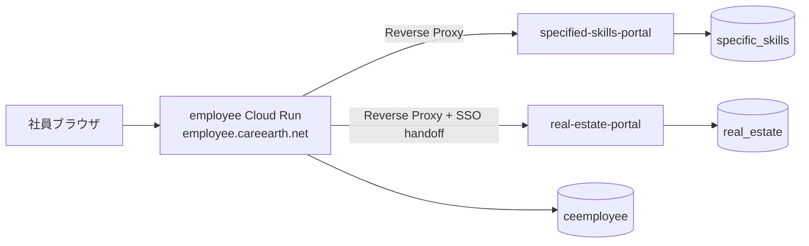
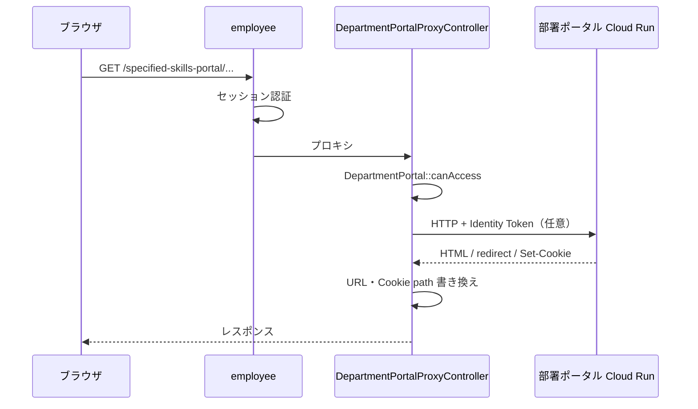

# アーキテクチャ概要

CE-Group 社員ポータルと部署別社内サイトの構成です。第三者向けの入口ドキュメントとして、コードと本番設定の対応を示します。

## コンテキスト図

## サービス一覧

| コンポーネント | リポジトリ | Cloud Run サービス | DB | 公開 URL（employee 経由） |
|----------------|------------|-------------------|-----|---------------------------|
| 社員サイト | employee | `employee` | `ceemployee` | https://employee.careearth.net |
| 特定技能 | specific_skills | `specified-skills-portal` | `specific_skills` | `/specified-skills-portal` |
| 不動産 | real-estate | `real-estate-portal` | `real_estate` | `/realestate-portal/home` |
| 経理・人事問い合わせ | employee/apps/finance-hr | （employee 同梱） | `finance_hr` | `/apps/finance-hr` |
| WordPress | employee/docker/wordpress | （employee 同梱） | `ceemployee`（wp_*） | `/wordpress` |

GCP プロジェクト: `ce-gr-employee-info-2606st` / リージョン: `asia-northeast1`

## 社員サイトの認証（入口）

| 環境 | 入口 | SSO |
|------|------|-----|
| 本番 | `/login`（`/` は準備中） | 通常ログイン（Sateraito SSO は **無効**） |
| ローカル | `/login` | 同上 |

Sateraito 関連コード（`PortalEntryGate` 等）は存在しますが、本番では `PORTAL_REQUIRE_SATERAITO_ENTRY=false` が前提です。詳細は [environments.md](environments.md)。

## 部署タブと権限

部署タブ定義: `app/Support/DashboardTab.php`  
ポータル接続先: `config/department_portals.php`

- ユーザーの **在籍中の所属** がタブの `keywords` にマッチするとタブ表示・ポータル利用可
- `common`（社員共通）タブには社内サイトリンクなし
- `internal_url` が空の部署はリンク非表示・プロキシ 503

経理課は特定技能・不動産タブにもアクセス可能（キーワードに `経理課` を含む）。

## 部署別社内サイト（プロキシ）

### 処理の流れ

実装:

- ルート: `routes/web.php`（`DepartmentPortal::all()` から動的登録）
- コントローラ: `DepartmentPortalProxyController`
- 設定ヘルパ: `App\Support\DepartmentPortal`
- 上流 HTTP: `DepartmentPortalUpstreamClient`
- レスポンス書き換え: `DepartmentPortalResponseRewriter`
- 不動産専用: `RealEstatePortalProxyHandler`

### 転送ヘッダ（employee → upstream）

| ヘッダ | 用途 |
|--------|------|
| `X-Employee-Portal: 1` | プロキシ経由であること |
| `X-Employee-Portal-Tab` | タブキー（例: `specified-skills`） |
| `X-Employee-Portal-Proxy-Secret` | 不動産など Proxy Secret 利用時 |
| `X-Employee-Portal-User-Email` 等 | ログイン社員情報（upstream 側の利用はポータル依存） |

### 認証方式の違い（重要）

| ポータル | employee → Cloud Run | upstream アプリ側 |
|----------|----------------------|-------------------|
| **特定技能** | Cloud Run **Identity Token**（本番デフォルト） | IAM で employee SA のみ invoker。アプリ内ヘッダ検証なし |
| **不動産** | Identity Token **または** Proxy Secret | `VerifyEmployeePortalProxySecret` + **SSO handoff**（初回 GET） |
| **未接続**（dispatch 等） | — | `internal_url` 未設定 → 503 |

Identity Token 取得: `DepartmentPortalIdentityToken`（GCP メタデータサーバー）。

不動産 SSO: `RealEstatePortalSsoHandoff` が upstream の handoff API をサーバー側で完結させ、ブラウザを callback にリダイレクトしない。

### URL 書き換え

upstream の HTML/CSS 内 URL と `Location` / `Set-Cookie` の path を、employee 上のプロキシ prefix（例: `/specified-skills-portal`）に書き換えます。

特定技能アプリ内部の `APP_BASE_PATH` は `/specific_skills`（ローカル直アクセス用）。本番プロキシ path との対応は [glossary.md](glossary.md)。

## 内部 API

### GET `/internal/portal/employee-directory`

不動産ポータル等が社員一覧を参照する API。

- ミドルウェア: `employee.portal.proxy`（`X-Employee-Portal-Proxy-Secret`）
- 実装: `Internal\EmployeeDirectoryController`
- データ: `EmployeeDirectoryService`

## Cloud Run Jobs（例）

| Job | 用途 |
|-----|------|
| `employee-sync-support-csv` | 特定技能 支援管理 CSV 同期 |
| migrate 系 | DB マイグレーション（deploy スクリプト参照） |

一覧・実行方法: [deploy/README.md](../deploy/README.md)

## テストで仕様を確認する

| テスト | 内容 |
|--------|------|
| `DepartmentPortalTest` | タブ権限・プロキシ 403 |
| `SpecifiedSkillsPortalTest` | 特定技能アクセス |
| `RealEstatePortalProxyPathTest` | path 正規化・リダイレクト |
| `RealEstatePortalSsoHandoffTest` | SSO handoff |
| `EmployeeDirectoryApiTest` | 内部 API |

## 関連ドキュメント

- [environments.md](environments.md) — 環境差分
- [glossary.md](glossary.md) — 用語
- [detailed-design.md](detailed-design.md) — 章別詳細
- [runbook.md](runbook.md) — 運用
