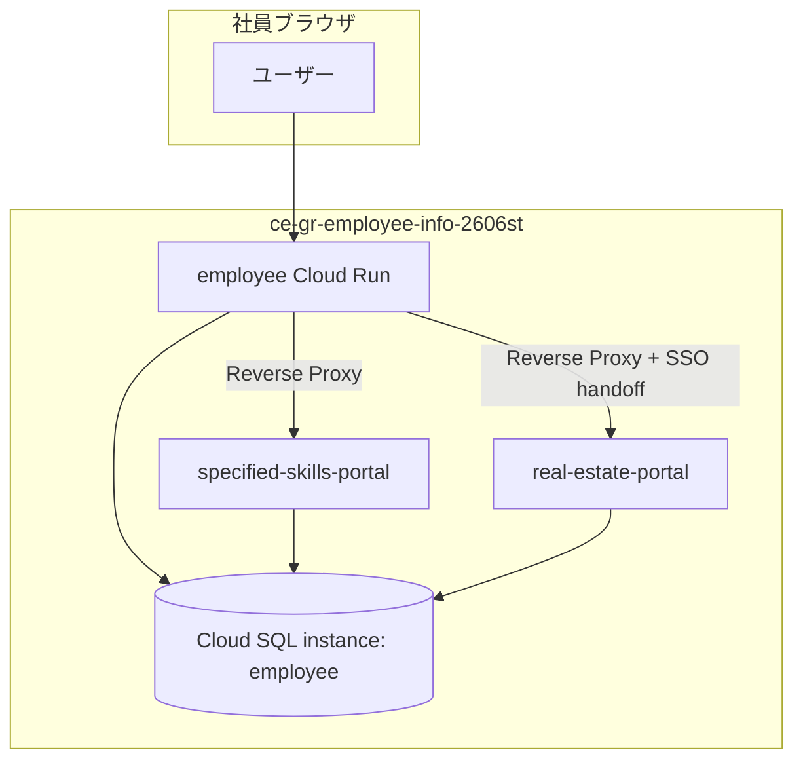
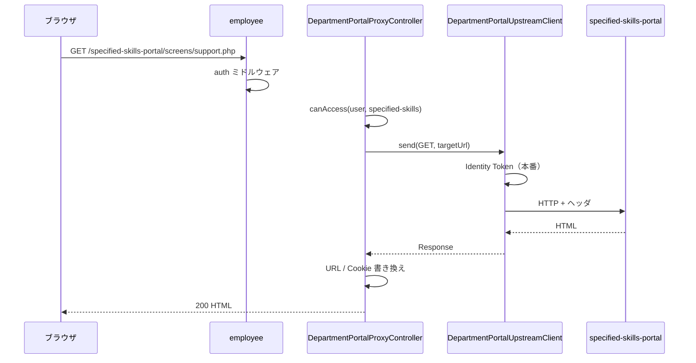
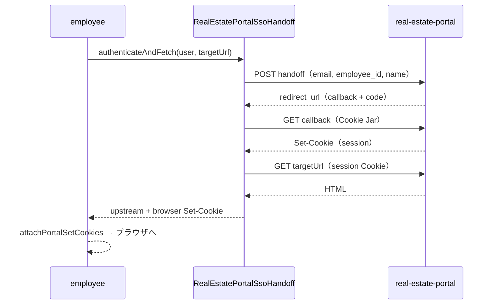

# 詳細設計書 — CE-Group 社員ポータル連携システム

| 項目 | 内容 |
|------|------|
| 文書種別 | 詳細設計書 |
| 対象システム | 社員サイト（employee）および接続部署ポータル |
| 本番 URL | https://employee.careearth.net |
| GCP プロジェクト | `ce-gr-employee-info-2606st` |
| リージョン | `asia-northeast1` |
| 正本 | 本ファイル（`docs/detailed-design.md`） |
| 関連 | [architecture.md](architecture.md) / [environments.md](environments.md) / [glossary.md](glossary.md) / [runbook.md](runbook.md) |

---

## 1. はじめに

### 1.1 目的

本書は、CE-Group 社員ポータル（employee）と部署別社内サイト（特定技能・不動産等）の **機能・連携・データ・運用** を第三者が理解・保守できる粒度で記述する。

アーキテクチャ概要は [architecture.md](architecture.md)、環境差分は [environments.md](environments.md) を参照する。本書は設計判断・処理手順・インタフェース仕様を詳述する。

### 1.2 読者

- 新規参加開発者（実装・レビュー）
- 運用担当（デプロイ・障害切り分け）
- 他部署ステークホルダー（範囲・接続関係の確認）

### 1.3 リポジトリ構成

| リポジトリ | パス（推奨） | 役割 |
|------------|--------------|------|
| employee | `htdocs/employee` | 社員サイト本体・プロキシ・同梱アプリ |
| specific_skills | `htdocs/specific_skills` | 特定技能ステータス管理 |
| real-estate | `htdocs/real-estate` | 不動産社内サイト（Laravel） |

---

## 2. スコープ

### 2.1 対象（本番稼働）

| コンポーネント | Cloud Run | DB | employee 上の path |
|----------------|-----------|-----|-------------------|
| 社員サイト | `employee` | `ceemployee` | `/`, `/login`, `/dashboard` 等 |
| 特定技能ポータル | `specified-skills-portal` | `specific_skills` | `/specified-skills-portal` |
| 不動産ポータル | `real-estate-portal` | `real_estate` | `/realestate-portal/home` |
| 経理・人事問い合わせ | （employee 同梱） | `finance_hr` | `/apps/finance-hr` |
| WordPress | （employee 同梱） | `ceemployee`（wp_*） | `/wordpress` |

### 2.2 対象外（本番で無効／未接続）

| 項目 | 状態 |
|------|------|
| Sateraito SSO 入場 | コードあり。`PORTAL_REQUIRE_SATERAITO_ENTRY=false` |
| 派遣 / 食品 / 通信 / 美容ポータル | `internal_url` 未設定 → リンク非表示 |
| さくら SMTP リレー | ローカル検証用。GitHub 非公開（`.gitignore`） |

### 2.3 システムコンテキスト



---

## 3. 社員サイト認証・入口

### 3.1 本番入口

| path | 処理 | 備考 |
|------|------|------|
| `/` | `/index` へリダイレクト | 準備中ページ |
| `/login` | 通常ログイン（email + password） | **本番の実入口** |
| `/dashboard` | 認証必須。部署タブ表示 | デフォルトタブは所属から決定 |

### 3.2 認証方式（本番）

- Laravel セッション認証（`auth` ミドルウェア）
- 強制パスワード変更（`ForcePasswordChange`）
- メール: Gmail SMTP（`deploy-gmail-mail-prod.cmd`）

### 3.3 Sateraito SSO（コードのみ・本番未使用）

| 設定 | ファイル | 説明 |
|------|----------|------|
| 入場ゲート | `config/portal_entry.php` | `PORTAL_REQUIRE_SATERAITO_ENTRY` |
| SSO 受信 | `config/sateraito_sso.php` | `SATERAITO_SSO_ENABLED` |
| 実装 | `PortalEntryGate`, `SateraitoSsoController` | Referer / SSO パラメータ検証 |

本番では上記 env を false のまま運用する。テストは `@group sateraito` で通常 CI から除外（`phpunit.xml`）。

---

## 4. 部署タブと権限

### 4.1 タブ定義

`app/Support/DashboardTab.php` の `TABS` 定数が唯一の定義源。

| key | label | keywords（部分一致） | 社内サイト |
|-----|-------|----------------------|------------|
| `common` | 社員共通 | （空＝全員） | なし |
| `dispatch` | 派遣事業 | 派遣事業, 派遣 | 将来 |
| `specified-skills` | 特定技能 | 特定技能, 経理課 | **接続済** |
| `real-estate` | 不動産 | 不動産, 経理課 | **接続済** |
| `food` | 食品 | 食品 | 将来 |
| `telecom` | 通信 | 通信 | 将来 |
| `beauty` | 美容 | 美容 | 将来 |
| `company-car` | 社用車 | （空） | なし（Drive 連携） |

### 4.2 権限判定ロジック

```
canViewTab(user, tabKey):
  common / company-car → 常に true
  その他 → user.currentAffiliation() の department / section が
           tab.keywords のいずれかを部分一致

DepartmentPortal::canAccess(user, tabKey):
  tabKey == common → false
  department_portals[tabKey].internal_url が空 → false
  上記 canViewTab と同等
```

**経理課** は `keywords` に「経理課」を含むため、特定技能・不動産タブおよびポータルにアクセス可能。

### 4.3 設定整合性

`DashboardTab` の key と `config/department_portals.php` のキーは一致必須。

```powershell
php artisan department-portals:check
```

ローカル起動時も `DepartmentPortalConfigValidator` が warning を出力する。

---

## 5. 部署ポータル連携（プロキシ）

### 5.1 設計方針

- ブラウザは **employee ドメインのみ** アクセス
- upstream（Cloud Run ポータル）は非公開。employee サービスアカウントが invoker または Proxy Secret で到達
- HTML / redirect / Cookie の path をプロキシ prefix に書き換え

設計判断: [decisions/001-reverse-proxy.md](decisions/001-reverse-proxy.md)

### 5.2 コンポーネント一覧

| 責務 | クラス / ファイル |
|------|-------------------|
| 設定 | `config/department_portals.php` |
| 権限・URL | `App\Support\DepartmentPortal` |
| ルート登録 | `routes/web.php`（`DepartmentPortal::all()` ループ） |
| オーケストレーション | `DepartmentPortalProxyController` |
| upstream HTTP | `DepartmentPortalUpstreamClient` |
| レスポンス書き換え | `DepartmentPortalResponseRewriter` |
| 不動産 SSO | `RealEstatePortalProxyHandler` |
| Identity Token | `DepartmentPortalIdentityToken` |
| 不動産 handoff API 呼出 | `RealEstatePortalSsoHandoff` |

### 5.3 ルート

`routes/web.php`（`auth` ミドルウェア内）:

```
foreach DepartmentPortal::all():
  entry_path あり → GET /{proxy_path} → redirect /{proxy_path}/{entry_path}
  ANY /{proxy_path}/{path?} → DepartmentPortalProxyController
```

例:

| proxy_path | entry_path | 入口 URL |
|------------|------------|----------|
| `realestate-portal` | `home` | `/realestate-portal/home` |
| `specified-skills-portal` | （空） | `/specified-skills-portal` |

### 5.4 通常プロキシ処理（特定技能等）



**処理ステップ:**

1. `findByProxyPath(portalPath)` で設定取得
2. `canAccess` — 403 if 権限なし
3. `internal_url` 空 — 503
4. `resolveUpstreamPath` — 重複 prefix 除去（`/realestate-portal/realestate-portal` → `/`）
5. `upstreamClient.send` — 502 on Token / 接続失敗
6. upstream 403 — 503（IAM / Secret メッセージ分岐）
7. `responseRewriter.toProxiedResponse`

### 5.5 転送ヘッダ（employee → upstream）

| ヘッダ名 | 定数 | 内容 |
|----------|------|------|
| `X-Employee-Portal` | `EMPLOYEE_PORTAL_HEADER` | `1` |
| `X-Employee-Portal-Tab` | `EMPLOYEE_PORTAL_TAB_HEADER` | 例: `specified-skills` |
| `X-Employee-Portal-Proxy-Secret` | `EMPLOYEE_PORTAL_PROXY_SECRET_HEADER` | 不動産等（設定時のみ） |
| `X-Employee-Portal-User-Email` | `EMPLOYEE_PORTAL_USER_EMAIL_HEADER` | ログインユーザ email |
| `X-Employee-Portal-User-Name` | `EMPLOYEE_PORTAL_USER_NAME_HEADER` | 氏名 |
| `X-Employee-Portal-User-Id` | `EMPLOYEE_PORTAL_USER_ID_HEADER` | 社員 ID |

転送される一般ヘッダ: `Accept`, `Accept-Language`, `Content-Type`, `Referer`, `X-CSRF-TOKEN`, `X-XSRF-TOKEN`, `Cookie`（ポータル依存でフィルタ）。

### 5.6 Identity Token

`DepartmentPortalIdentityToken::token(tabKey, audience)`:

- `DepartmentPortal::shouldUseIdentityToken(tabKey)` が false → null（Token なし）
- true → GCP メタデータサーバーから OIDC Token（audience = upstream URL）

判定:

| 条件 | Token |
|------|-------|
| `use_identity_token` env が明示 | その値 |
| `proxy_secret` あり & env 未設定 | false |
| 上記以外 & `APP_ENV=production` | true |

### 5.7 レスポンス書き換え

`DepartmentPortalResponseRewriter`:

| 対象 | 処理 |
|------|------|
| HTML / CSS body | upstream URL → プロキシ base URL |
| ルート相対 `href` / `action` / `src` | プロキシ prefix 付与 |
| `Location` | 同上 |
| `Set-Cookie` | `path=/realestate-portal` 等に変更 |

不動産固有: `realestate.careearth.net` も置換対象。

### 5.8 不動産 SSO handoff

初回 GET で `real_estate_portal_session` Cookie が無い場合、または upstream 404 かつ retry 条件を満たす場合に実行。



**RealEstatePortalProxyHandler 追加処理:**

- `logout` path → upstream POST（任意）→ dashboard へ redirect → portal Cookie 削除
- Cookie 転送: `real_estate_portal_session`, `XSRF-TOKEN` のみ upstream へ

**upstream 側:**

- `EmployeePortalSsoService::createHandoff` — ワンタイム code を Cache に保存
- `AuthController::portalCallback` — code 検証 → `CareEarthUser` ログイン

### 5.9 認証方式比較

| ポータル | employee → Cloud Run | upstream アプリ |
|----------|----------------------|-----------------|
| 特定技能 | Identity Token | IAM invoker のみ。**ヘッダ検証なし** |
| 不動産 | Identity Token または Proxy Secret | `VerifyEmployeePortalProxySecret` + SSO |
| 未設定部署 | — | 503 |

### 5.10 エラー仕様

| HTTP | 発生条件 | ユーザー向けメッセージ例 |
|------|----------|--------------------------|
| 403 | employee 側 `canAccess` 失敗 | 「〇〇を利用する権限がありません」 |
| 502 | Token 取得失敗 / SSO 失敗 / upstream 接続不可 | 「認証に失敗」「接続できません」 |
| 503 | `internal_url` 未設定 / upstream 403 | IAM または Proxy Secret 設定を案内 |

運用切り分け: [runbook.md](runbook.md)

### 5.11 環境変数（プロキシ関連）

| 変数 | 用途 |
|------|------|
| `REAL_ESTATE_PORTAL_INTERNAL_URL` | 不動産 upstream |
| `REAL_ESTATE_PORTAL_USE_IDENTITY_TOKEN` | Token ON/OFF |
| `EMPLOYEE_PORTAL_PROXY_SECRET` | 不動産 Proxy Secret（employee / real-estate 共通） |
| `SPECIFIED_SKILLS_PORTAL_INTERNAL_URL` | 特定技能 upstream |
| `SPECIFIED_SKILLS_PORTAL_USE_IDENTITY_TOKEN` | Token ON/OFF |
| `DISPATCH/FOOD/TELECOM/BEAUTY_*` | 将来用 |

---

## 6. 社員サイト（employee）詳細

### 6.1 主要機能モジュール

| 機能 | Controller / Service | 説明 |
|------|---------------------|------|
| ダッシュボード | `DashboardController` | 部署タブ別お知らせ・リンク |
| 所属管理 | `AffiliationController` | 所属履歴 CRUD → タブ権限の根拠 |
| 社員一覧 | `EmployeeController` | 検索・プロフィール |
| 人事詳細 CSV | `ProfileHrDetailController` | エクスポート |
| 備品購入 | `EquipmentPurchaseController` | 申請・承認メール |
| 開発依頼 | `DevelopmentRequestController` | Chat 通知 |
| 組織図 | `OrgChartController` | 静的 HTML 配信 |
| 社用車連携 | `DriveAppSyncController` | gas-app へ staff 同期 |
| finance-hr SSO | `FinanceHrSsoController` | JWT 署名付きリダイレクト |
| 内部 API | `EmployeeDirectoryController` | 不動産向け社員検索 |

### 6.2 データモデル（概要）

**DB:** `ceemployee`（Cloud SQL）

| テーブル群 | 用途 |
|------------|------|
| `users`, `profiles` | 社員基本情報 |
| `affiliation_histories` | 所属履歴（タブ権限） |
| `employee_hr_details` | 人事詳細 |
| `dashboard_contents`, `dashboard_links` | タブ別コンテンツ |
| `equipment_purchase_applications` | 備品購入 |
| `sessions` | 本番セッション |

所属の **在籍中** レコードが `DashboardTab::userMatchesTab` の入力となる。

### 6.3 ダッシュボードとポータルリンク

- 各タブ view で `DepartmentPortal::entryUrl(tabKey)` が非 null なら「社内サイト」リンク表示
- `common` タブは社員一覧リンクのみ（ポータルなし）

### 6.4 内部 API: 社員ディレクトリ

**エンドポイント:** `GET /internal/portal/employee-directory`

**認証:** ミドルウェア `employee.portal.proxy` → `VerifyEmployeePortalProxySecret`

**クエリ:**

| パラメータ | 説明 |
|------------|------|
| `keyword` | 氏名・email・社員 ID・所属等 |
| `status` | 雇用ステータス（デフォルト: 在籍） |
| `department` | 部署フィルタ |

**レスポンス:** JSON `{ employees: [...], meta: {...} }`（最大 200 件）

**実装:** `EmployeeDirectoryService::search` — 経理課等キーワード時は部署フィルタをスキップする特例あり。

---

## 7. 特定技能ポータル

### 7.1 概要

| 項目 | 内容 |
|------|------|
| リポジトリ | `specific_skills` |
| 技術 | PHP + MySQL（フレームワークなし） |
| Cloud Run | `specified-skills-portal` |
| DB | `specific_skills` |
| ローカル path | `/specific_skills`（`APP_BASE_PATH`） |
| 本番 path | `/specified-skills-portal`（employee プロキシ） |

### 7.2 画面構成

| 画面 ID | ファイル | 機能 |
|---------|----------|------|
| applicants | `screens/applicants.php` | 応募者管理 |
| internal_interviews | `screens/internal_interviews.php` | 社内面談 |
| rejected_list | `screens/rejected_list.php` | 不採用リスト |
| company_interviews | `screens/company_interviews.php` | 企業面接 |
| offer_holders | `screens/offer_holders.php` | 内定者 |
| offer_withdrawals | `screens/offer_withdrawals.php` | 内定辞退 |
| support | `screens/support.php` | **支援管理** |
| staff_management | `screens/staff_management.php` | スタッフ管理 |

API: `api/` 配下（CSV import, CRUD, 画像 upload 等）

### 7.3 データモデル（主要テーブル）

| テーブル | 用途 |
|----------|------|
| `staff` | スタッフマスター（status でライフサイクル管理） |
| `companies` | 企業マスター |
| `interviews` | 面接管理 |
| （migrations 参照） | 支援書類画像、ステータス拡張等 |

**staff.status 例:** 応募 → 社内面談中 → 企業面接中 → 内定 → **支援中** / 支援終了 / 不採用 等

スキーマ正本: `database/schema.sql`, `database/migrations/`

### 7.4 認証（現状）

| 層 | 方式 |
|----|------|
| Cloud Run | IAM: employee SA の `run.invoker` |
| employee プロキシ | Identity Token 付与 |
| アプリ PHP | **独自認証なし**（非公開 Cloud Run に依存） |

`X-Employee-Portal-*` ヘッダは employee から送られるが、**upstream 側未検証**（将来 middleware 追加余地あり）。

### 7.5 運用: 支援管理 CSV 同期

| 項目 | 内容 |
|------|------|
| Job | `employee-sync-support-csv` |
| スクリプト | `deploy/sync-support-csv-prod.cmd` |
| 処理 | CSV と DB 比較 → 新規 add-only / `--promote-missing` で status のみ昇格 |
| 方針 | **既存レコードのフィールドは更新しない** |

---

## 8. 不動産ポータル

### 8.1 概要

| 項目 | 内容 |
|------|------|
| リポジトリ | `real-estate` |
| 技術 | Laravel |
| Cloud Run | `real-estate-portal` |
| DB | `real_estate` |
| 入口 | `/realestate-portal/home` |

### 8.2 認証構成

**設定:** `config/employee-portal.php`

| env | 説明 |
|-----|------|
| `EMPLOYEE_PORTAL_SSO_ENABLED` | SSO handoff 有効化 |
| `EMPLOYEE_PORTAL_PROXY_SECRET` | プロキシ / 内部 API 共有秘密 |
| `EMPLOYEE_PORTAL_API_URL` | employee 社員ディレクトリ URL |
| `EMPLOYEE_PORTAL_LOGIN_URL` | 社員ポータルへのリンク |
| `LOCAL_LOGIN_FALLBACK_ENABLED` | ローカル ID/PW ログイン（通常 false） |

**ミドルウェア:**

| 名称 | 用途 |
|------|------|
| `VerifyEmployeePortalProxySecret` | 内部 API・handoff のサーバー間認証 |
| `CareEarthAuth` | ログイン済みユーザの業務画面 |

### 8.3 主要ルート

| path | 処理 |
|------|------|
| `auth/portal/redirect` | 社員ポータルへ誘導 |
| `auth/portal/callback` | handoff code → セッション確立 |
| `internal/portal/*` | handoff API 等 |
| `admin/*`, `master/*` | 業務画面（認証必須） |

### 8.4 employee 連携

1. ユーザが employee 経由で `/realestate-portal/home` にアクセス
2. employee が SSO handoff をサーバー側実行
3. 不動産側 `CareEarthUser` セッション確立
4. 業務中は `real_estate_portal_session` Cookie（path: `/realestate-portal`）
5. 社員検索が必要な画面は employee `EmployeeDirectoryService` を Proxy Secret 付きで呼出

### 8.5 デプロイ

| スクリプト | 用途 |
|------------|------|
| `deploy-realestate-portal.cmd` | イメージ + Cloud SQL |
| `setup-realestate-proxy.cmd` | Proxy Secret + employee env 更新 |
| `migrate-real-estate-prod.cmd` | DB migrate Job |

---

## 9. 同梱アプリ

### 9.1 finance-hr（経理・人事問い合わせ）

| 項目 | 内容 |
|------|------|
| path | `/apps/finance-hr` |
| 入口 | `GET /apps/finance-hr` → `FinanceHrSsoController` |
| DB | `finance_hr` |
| SSO | JWT（`FINANCE_HR_SSO_SECRET`）で payload 署名 → リダイレクト |

### 9.2 WordPress

| 項目 | 内容 |
|------|------|
| path | `/wordpress` |
| DB | `ceemployee` 内 wp_* |
| メディア | GCS（WP-Stateless / ADC） |

---

## 10. 運用設計

### 10.1 Cloud Run サービス

| サービス | デプロイ |
|----------|----------|
| `employee` | `deploy-employee-cloudbuild.cmd` |
| `specified-skills-portal` | `deploy-specified-skills-portal.cmd` |
| `real-estate-portal` | `deploy-realestate-portal.cmd` |

### 10.2 Cloud Run Jobs（代表）

| Job | 用途 |
|-----|------|
| `employee-sync-support-csv` | 支援管理 CSV 同期 |
| migrate 系 | `migrate-*-prod.cmd` 参照 |

### 10.3 デプロイ順序（ポータル更新時）

1. sibling リポジトリ変更
2. ポータル Cloud Run デプロイ
3. migrate Job（必要時）
4. employee env の `*_PORTAL_INTERNAL_URL` 確認
5. ブラウザでプロキシ path 動作確認

詳細: [deploy/README.md](../deploy/README.md)

### 10.4 バックアップ

- `deploy/backup-cloudsql.cmd`
- GCS: `gs://ce-gr-employee-info-2606st-sql-backups/`

### 10.5 監視・ログ

```powershell
gcloud logging read "resource.type=cloud_run_revision AND resource.labels.service_name=employee" --limit=50 --project=ce-gr-employee-info-2606st
```

障害切り分け: [runbook.md](runbook.md)

---

## 11. テスト設計

### 11.1 方針

PHPUnit テストを **仕様の参照** とする。ファイル名・メソッド名が期待動作を表す。

### 11.2 主要テスト一覧

| テスト | 検証内容 |
|--------|----------|
| `DepartmentPortalTest` | タブ権限、entry URL、Token 設定 |
| `SpecifiedSkillsPortalTest` | 特定技能アクセス、経理課 |
| `RealEstatePortalTest` | リンク、Cookie 転送、HTML 書き換え、logout |
| `RealEstatePortalProxyPathTest` | path 正規化 |
| `RealEstatePortalSsoHandoffTest` | SSO handoff フロー |
| `EmployeeDirectoryApiTest` | 内部 API |
| `DepartmentPortalConfigValidatorTest` | 設定整合性 |

```powershell
php artisan test --filter=DepartmentPortal
php artisan department-portals:check
```

詳細: [tests/README.md](../tests/README.md)

---

## 12. 付録

### 12.1 用語・URL 対応表

→ [glossary.md](glossary.md)

### 12.2 環境一覧

→ [environments.md](environments.md)

### 12.3 設計判断（ADR）

| ID | 決定 | 理由 |
|----|------|------|
| 001 | Reverse Proxy | 単一ドメイン・Cookie 統合 |
| — | 不動産のみ SSO handoff | upstream 独自セッション |
| — | 特定技能 IAM のみ | シンプル PHP・非公開 Run |
| — | portal を employee GCP に配置 | クロスプロジェクト IAM 回避 |

### 12.4 改訂履歴

| 版 | 日付 | 内容 |
|----|------|------|
| 0.1 | 2026-08-27 | アウトライン（ソース突合） |
| 1.0 | 2026-08-27 | 詳細設計書として全面拡張（architecture / environments / glossary / runbook / ソース突合） |
